### Hello there 👋

I'm Scott Mangiapane, a software engineer in Chicago, IL. I first started programming on my TI-84 graphing calculator back in high school math class. I've come a long way since then, but have maintained that same enthusiasm. Check out what I've been up to below.

> "Programming isn't about what you know; it's about what you can figure out." – Chris Pine  
> (not the Star Trek guy, the other one)

|  |  |
| ------------- | ------------- |
